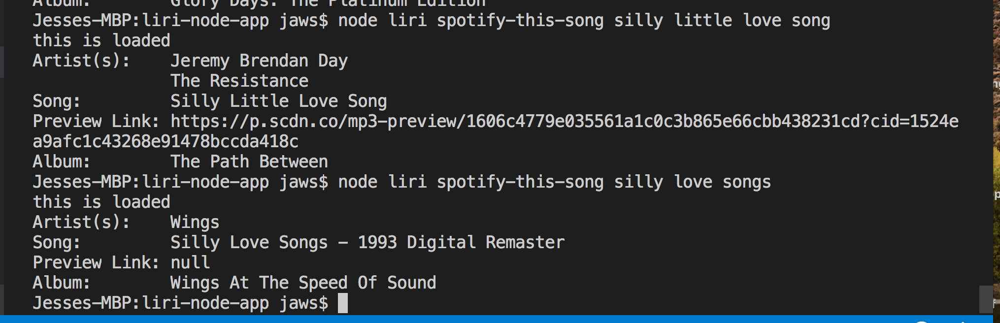

# liri node app #

## There are four commands in this program ##
1. spotify-this-song - user must put in a name of a song in quotes with this command

2. concert-this - user must put in name of artist/band with this command
3. movie-this - user must put in name of movie in quotes with this command
4. do-what-it-says - no other input is needed. This command reads random.txt for command

